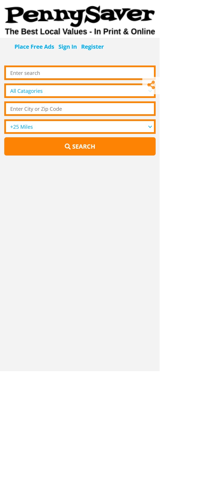
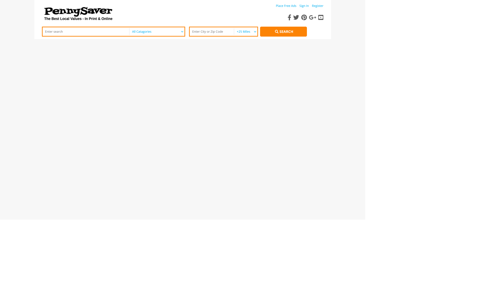

# cloning the header part of the pennysaverusa.com website

## Table of contents

- [Overview](#overview)
  - [The challenge](#the-challenge)
  - [Screenshot](#screenshot)
  - [Links](#links)
- [My process](#my-process)
  - [Built with](#built-with)
  - [Continued development](#continued-development)
- [Author](#author)

## Overview

### The challenge

cloning the header part of the [pennysaverwebsite](https://www.pennysaverusa.com/)

### Screenshot

A,mobile view of my solution

A,desktop view of my solution

### Links

- Live Site URL: [live site URL](https://aemrobe.github.io/cloning-pennysave-website-navbar/)

## My process

### Built with

- Semantic HTML5 markup
- CSS custom properties
- Flexbox
- javascript
- Mobile-first workflow

### Continued development

I will mainly focus on the challenges which make me to understand how javascript works because now I am studying javascript and I will keep work mainly on the challenge which involve javascript but together with that I will keep reinforcing my css skills too.

## Author

-Frontend Mentor - [@aemrobe](https://www.frontendmentor.io/profile/aemrobe)
-Twitter - [@Aemro112](https://www.twitter.com/Aemro112)
